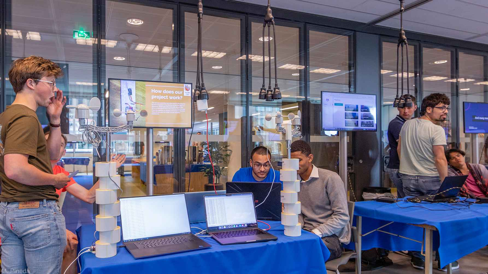

# Opdracht omschrijving

## Context

Dit is het project voor Technische Informatica in blok 2, in het studiejaar 2023 - 2024. In het eerste blok heb je gewerkt aan een Climate Measuring Box om zelf metingen te verrichten en deze vervolgens te visualiseren op een webpagina. In dit blok ga je werken aan het project Game Controller, hiervoor maak je gebruik van de kennis die je in blok 1 hebt opgedaan en ga je aan de slag om nieuwe kennis op te doen.

Voor dit project ga je aan de slag met het bouwen van een website (je game console), het bouwen van een embedded systeem (je controller) en een database (voor de highscores).

## Opdracht

Op de open dag willen we studiekiezers, jongeren die een studiekeuze moeten maken, laten zien wat studenten HBO-ICT al kunnen maken in het begin van hun opleiding. Studiekiezers lopen rond en kunnen bij verschillende stands een kijkje nemen. 

Alleen kijken is niet genoeg, we willen ze ook iets laten doen. Daarom is de opdracht voor jullie:

> Maak een game die de studiekiezer makkelijk kan spelen op de open dag. Laat de studiekiezer de game spelen met je eigen, zelfgemaakte gamecontroller.

Stel je voor dat er op de 5e verdieping overal grote schermen staan waar draadloze gamecontrollers voor zijn gepositioneerd. Een bezoeker loopt er op af, pakt de controller en kan gelijk gaan spelen. Als de game afgelopen is kan de bezoeker zijn naam invullen en wordt de highscore opgeslagen in een database. De bezoeker kan thuis op een website de highscores bekijken.

Om dit voor elkaar te krijgen zullen de games makkelijk moeten kunnen worden klaargezet door het personeel dat op de open dag aanwezig is.

## Vereisten

### Het product

- De game moet makkelijk te bedienen en te begrijpen zijn voor de speler.
- De medewerkers van de open dag moeten de game makkelijk kunnen klaarzetten en opstarten.
- Na het spelen van de game moeten achievements en highscores worden opgeslagen in een database.
- De speler moet de achievements en highscores thuis kunnen bekijken op een webpagina.

!!! tip "Tip: Simpele Game Mechanics"

    Om de game simpel te houden zullen de input mogelijkheden beperkt moeten zijn. Gebruik zo min mogelijk knoppen. Om je te helpen bij het bedenken van de game mechanics, hieronder een lijst met mogelijke game mechanics.

    - Het drukken van een knop op een specifiek tijdstip.
    - Het drukken van een knop op een specifiek tijdsinterval.
    - Het drukken van een knop op een specifiek tijdsinterval, waarbij de interval steeds korter wordt.
    - Het drukken van een knop op een specifiek tijdsinterval, waarbij de interval steeds langer wordt.
    - Hoe verder je in het spel zit, hoe sneller je moet reageren.
    - Het indrukken van de knop en loslaten op een specifiek tijdstip.
        - Opladen; bijvoorbeeld krachtiger, harder, sneller, ...
        - Afvuren; bijvoorbeeld schieten, springen, ...
    - Het herhaarlijk indrukken van een knop.
        - Bijvoorbeeld om te rennen, springen, ...

## Techniek

- de game wordt gespeeld vanuit een webpagina
- de game is geprogrammeerd in JavaScript
- p5.js wordt gebruikt voor het tekenen van de game

{{ mdocotion_header('https://images.unsplash.com/photo-1586892477838-2b96e85e0f96?q=80&w=2059&auto=format&fit=crop&ixlib=rb-4.0.3&ixid=M3wxMjA3fDB8MHxwaG90by1wYWdlfHx8fGVufDB8fHx8fA%3D%3D') }}