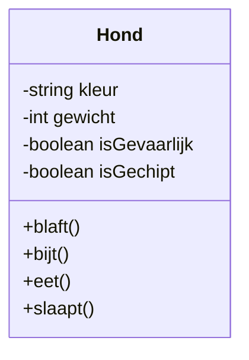
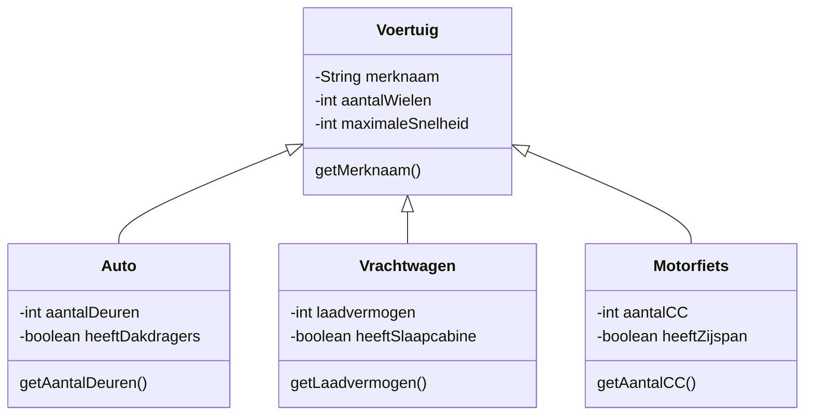

# Overzicht userstories

## Als gebruiker wil ik de behaalde resultaten van het spel zien in de vorm van highscores zodat ik kan zien wat de hoogst behaalde scores zijn

### Issue Details

**Labels:** `Type::User Story`

#### Beschrijving

Niks is leuker dan de beste te zijn in een spel. Gun jouw gebruiker die ervaring door een overzicht van de 10 beste scores weer te geven.

??? note "Definitions of Done"

    #### Definitions of Done

    - [ ] Alle acceptatie criteria zijn behaald
    - [ ] Het werk is gedocumenteerd, zodat een teamlid hiermee verder kan
    - [ ] Het werk is geschreven in Standaardnederlands
    - [ ] Het werk staat op de gitlab repository
    - [ ] Het werk is gereviewd door een peer

    ##### Software specifiek

    - [ ] De code is opgesteld volgens de HBO-ICT code conventions
    - [ ] De code is handmatig functioneel getest op fouten
    - [ ] De code werkt zonder fouten bij normaal gebruik

#### Acceptatie criteria

- [ ] De score wordt tijdens het spelen periodiek opgeslagen in de database.
- [ ] Aan het einde van het spel wordt de score weergegeven naast de 10 eerder behaalde high scores van alle spelers van het spel.
- [ ] Alleen de 10 hoogst behaalde scores worden weergegeven in het overzicht.
- [ ] De scores worden voor aanvang van het spel weergegeven in een overzicht.

---

## Als gebruiker wil ik mijn naam kunnen achterlaten bij mijn score zodat in het score overzicht te zien is dat de score door mij gehaald is

### Issue Details

**Labels:** `Type::User Story`

#### Beschrijving

Als je een high score heb behaald, dan wil je wel dat iedereen weet dat jij dat was. Geef dus ook de gebruiker van jouw spel de mogelijkheid om zijn ego te strelen.

??? note "Definitions of Done"

    #### Definitions of Done

    - [ ] Alle acceptatie criteria zijn behaald
    - [ ] Het werk is gedocumenteerd, zodat een teamlid hiermee verder kan
    - [ ] Het werk is geschreven in Standaardnederlands
    - [ ] Het werk staat op de gitlab repository
    - [ ] Het werk is gereviewd door een peer

    ##### Software specifiek

    - [ ] De code is opgesteld volgens de HBO-ICT code conventions
    - [ ] De code is handmatig functioneel getest op fouten
    - [ ] De code werkt zonder fouten bij normaal gebruik

#### Acceptatie criteria

- [ ] Aan het einde van het spel wordt de score weergegeven naast de eerder behaalde scores van de spelers van het spel.
- [ ] Alleen de hoogst behaalde score van de speler wordt weergegeven in het overzicht, maar alle behaalde scores worden bewaard.
- [ ] De speler kan een naam koppelen aan de score aan het einde van het spel door een naam in te voeren.
- [ ] Voor het invoeren van de naam zijn minimaal 1 knop nodig voor het wisselen van characters en 1 knop voor de volgende character.
- [ ] Zowel de controller als het toetsenbord kunnen gebruikt worden om de naam in te voeren.
- [ ] Alleen ASCII characters kunnen ingevoerd worden.

---

## Als gebruiker wil ik de 'game console' op de website volledig bedienen met een controller zodat ik niet hoef te wisselen tussen controller en laptop toetsenbord

### Issue Details

#### Labels:** `Type::User Stor**Beschrijving**  

??? note "Definitions of Done"

    #### Definitions of Done

    - [ ] Alle acceptatie criteria zijn behaald
    - [ ] Het werk is gedocumenteerd, zodat een teamlid hiermee verder kan
    - [ ] Het werk is geschreven in Standaardnederlands
    - [ ] Het werk staat op de gitlab repository
    - [ ] Het werk is gereviewd door een peer

    ##### Software specifiek

    - [ ] De code is opgesteld volgens de HBO-ICT code conventions
    - [ ] De code is handmatig functioneel getest op fouten
    - [ ] De code werkt zonder fouten bij normaal gebruik

#### Acceptatie criteria

- [ ] ...
- [ ] ...
- [ ] ...

---

## Als gebruiker wil ik op een website een virtuele 'game console' ervaring waardoor ik echt het gevoel krijg dat ik een spel ga opstarten

### Issue Details

**Labels:** `Type::User Story`

#### Beschrijving

Voor een goede gebruikerservaring van het spelen van een spel is het uiterlijk en gedrag van de applicatie van grote invloed. Omdat we een game gaan maken met controller, willen we ook echt dat game console gevoel geven. Het is niet de bedoeling dat de gebruiker het gevoel heeft op een website te zitten. Het gevoel dat dit een game console is moet zowel in uiterlijk als gedrag gerealiseerd worden.

??? note "Definitions of Done"

    #### Definitions of Done

    - [ ] Alle acceptatie criteria zijn behaald
    - [ ] Het werk is gedocumenteerd, zodat een teamlid hiermee verder kan
    - [ ] Het werk is geschreven in Standaardnederlands
    - [ ] Het werk staat op de gitlab repository
    - [ ] Het werk is gereviewd door een peer

    ##### Software specifiek

    - [ ] De code is opgesteld volgens de HBO-ICT code conventions
    - [ ] De code is handmatig functioneel getest op fouten
    - [ ] De code werkt zonder fouten bij normaal gebruik

#### Acceptatie criteria

- [ ] De virtuele game console heeft de kleurgebruik, tekst type, tekst grote en visuele inrichting die past bij game consoles.
- [ ] De virtuele game console kan fullscreen gedraaid worden, zodat alle webbrowser aspecten verborgen zijn.
- [ ] Het gedrag van de game console is zodanig dat de gebruiker het idee heeft dat het spel geladen wordt, en er ook andere spellen geladen zouden kunnen worden.
- [ ] Vormgeven is zo veel mogelijk verzorgt middels CSS. Overige componenten zijn verzorgt via HTML Canvas en JavaScript.
- [ ] (Nice to have) De vormgeving is dusdanig opgezet dat er van type virtuele game console ervaring (bijv. tussen retro 8-bit en next-gen) gewisseld kan worden naar smaak van de gebruiker.

---

## Als gebruiker wil ik als eerste een uitleg-scherm krijgen bij het opstarten van een spel zodat ik instructies krijg over hoe het spel gespeeld moet worden

### Issue Details

**Labels:** `Type::User Story`

#### Beschrijving

Je spel moet out-of-the-box te spelen zijn. Er is dus geen handleiding nodig, alle uitleg die het spel nodig heeft in gebruik en speldoel moet het spel zelf geven.

??? note "Definitions of Done"

    #### Definitions of Done

    - [ ] Alle acceptatie criteria zijn behaald
    - [ ] Het werk is gedocumenteerd, zodat een teamlid hiermee verder kan
    - [ ] Het werk is geschreven in Standaardnederlands
    - [ ] Het werk staat op de gitlab repository
    - [ ] Het werk is gereviewd door een peer

    ##### Software specifiek

    - [ ] De code is opgesteld volgens de HBO-ICT code conventions
    - [ ] De code is handmatig functioneel getest op fouten
    - [ ] De code werkt zonder fouten bij normaal gebruik

#### Acceptatie criteria

- [ ] Bij het opstarten van het spel is er een uitleg over hoe je het spel speelt.
- [ ] De uitleg beschrijft hoe je het spel bedient met de controller.
- [ ] De uitleg beschrijft hoe je het spel bedient met het toetsenbord.
- [ ] De uitleg beschrijft wat het doel is van het spel.
- [ ] De uitleg is niet alleen tekst, maar ook visueel.
- [ ] De uitleg is op een later moment ook oproepbaar.
- [ ] De uitleg kan met één druk op de knop weggehaald worden.
- [ ] De uitleg past bij de vormgeving van het spel.
- [ ] Wanneer de speler af is en een nieuw spel start wordt de uitleg NIET weer opnieuw gegeven.

---

## Als gebruiker wil ik het spel kunnen spelen door middel van één knop zodat je minimaal één van de game mechanics kan toepassen

### Issue Details

**Labels:** `Type::User Story`

#### Beschrijving

Een goed leuk spel wat makkelijk te spelen is heeft niet teveel knoppen en geen moeilijke knoppen combinaties. Ook dit spel moet simpel zijn in gebruikt. Beperk de game dynamics zodanig dat er maar één knop nodig is om een standaard actie te voeren. Een goed voorbeeld is de [Google Chrome Dino](https://chromedino.com/mario/) waarbij met één knop de dino bestuurd wordt. Maar er is een heel genre [arcade achtige games](https://www.crazygames.com/t/one-button) waarbij maar één knop nodig is.

??? note "Definitions of Done"

    #### Definitions of Done

    - [ ] Alle acceptatie criteria zijn behaald
    - [ ] Het werk is gedocumenteerd, zodat een teamlid hiermee verder kan
    - [ ] Het werk is geschreven in Standaardnederlands
    - [ ] Het werk staat op de gitlab repository
    - [ ] Het werk is gereviewd door een peer

    ##### Software specifiek

    - [ ] De code is opgesteld volgens de HBO-ICT code conventions
    - [ ] De code is handmatig functioneel getest op fouten
    - [ ] De code werkt zonder fouten bij normaal gebruik

#### Acceptatie criteria

- [ ] Een toets van het toetsenbord kan gebruikt worden voor de basis actie.
- [ ] De toetsen van het toetsenbord die gebruik worden zijn logische voor de interactie. (bijvoorbeeld pijltjes toetsen voor richting, spatie voor springen)
- [ ] Er is een maximum van 8 toetsen nodig voor de totale interactie van het spel.
- [ ] Er zijn geen toetsencombinaties nodig voor standaard interactie.
- [ ] De functionaliteit van de applicatie is los gekoppeld aan de toetsen.
- [ ] De keuze van toetsen voor het toetsenbord zijn makkelijk te veranderen in de applicatie

---

## Als gebruiker wil ik dat mijn invoer op de controller direct invloed uitoefent op het spel zodat ik 'low input lag'-spellen kan spelen

### Issue Details

**Labels:** `Type::User Story`

#### Beschrijving

Een snelle 'low input lag' zorgt voor een goede spelervaring. Als een reactie van het indrukken van een knop onder de 20ms is, ervaren we dit als direct. Als de reactie tever van deze reactietijd zit, bijvoorbeeld 100ms, dan ervaren we dat als lag. Bij nog tragere reactie tijd gaan we vermoeden dat het systeem vastloopt en haken we af. Nog erger reacties boven de 100ms [beïnvloeden een goede gaming experience](http://www.cse.yorku.ca/~andriyp/papers/p109-pavlovych.pdf). Belangrijk dus dat we zorgen dat de reactie snelheid van het systeem op de controller snel is en dicht bij die 20ms zit.

??? note "Definitions of Done"

    #### Definitions of Done

    - [ ] Alle acceptatie criteria zijn behaald
    - [ ] Het werk is gedocumenteerd, zodat een teamlid hiermee verder kan
    - [ ] Het werk is geschreven in Standaardnederlands
    - [ ] Het werk staat op de gitlab repository
    - [ ] Het werk is gereviewd door een peer

    ##### Software specifiek

    - [ ] De code is opgesteld volgens de HBO-ICT code conventions
    - [ ] De code is handmatig functioneel getest op fouten
    - [ ] De code werkt zonder fouten bij normaal gebruik

#### Acceptatie criteria

- [ ] Idealiter is binnen minimaal 20ms en maximaal 100ms) voor de gebruiker een reactie zichtbaar op de virtual console na het indrukken van een knop.
- [ ] De microcontroller registeerd minimaal binnen 100ms dat een knop is ingedrukt.
- [ ] De microcontroller mist geen ingedrukte knoppen.
- [ ] De microcontroller verstuurd iedere ingedrukte knop naar de virtual console.
- [ ] De microcontroller registeerd los dat een knop is ingedrukt (pressed) en een knop is losgelaten(released).
- [ ] De microcontroller moet minimaal via een seriële vrrbinding contact hebben met de virtual console.
- [ ] (Nice to have) De microcontroller heeft via een draadloze verbinding contact met de virtual console.
- [ ] De oplossing is schematisch vastgelegd.

---

## Als gebruiker wil tijdens het spelen mijn score 'live' zien zodat ik weet wat de progressie is die ik aan het maken ben tijdens het spelen

### Issue Details

**Labels:** `Type::User Story`

#### Beschrijving

Het zien van de voortgang in een spel helpt een gebruiker om het overzicht te houden, maar kan ook bijdragen aan het competitie aspect. Hoe gaaf is het als het publiek ziet dat jij de hoogste score aan het behalen bent!

??? note "Definitions of Done"

    #### Definitions of Done

    - [ ] Alle acceptatie criteria zijn behaald
    - [ ] Het werk is gedocumenteerd, zodat een teamlid hiermee verder kan
    - [ ] Het werk is geschreven in Standaardnederlands
    - [ ] Het werk staat op de gitlab repository
    - [ ] Het werk is gereviewd door een peer

    ##### Software specifiek

    - [ ] De code is opgesteld volgens de HBO-ICT code conventions
    - [ ] De code is handmatig functioneel getest op fouten
    - [ ] De code werkt zonder fouten bij normaal gebruik

#### Acceptatie criteria

- [ ] De score van de gebruiker wordt bijgehouden vanaf het moment dat het spel gespeeld wordt.
- [ ] De score wordt weergegeven op het scherm, zodat de gebruiker het kan zien, maar de score niet het spellen belemmerd.
- [ ] De score loopt op naarmate de speler verder komt in het spel.

---

## Als gebruiker wil ik dat mijn spelstatus wordt opgeslagen in een database, zodat ik op een later moment het spel kan hervatten

### Issue Details

**Labels:** `Type::User Story`

#### Beschrijving

Niks is vervelender dan te moeten stoppen met een spel dat je leuk vindt. Hoe fijn is het dan wanneer je terug komt, je verder kan gaan waar je gebleven bent. Kortom je spel moet de gebruiker de mogelijkheid geven om het spel op te slaan en op een later tijdstip te hervatten.

??? note "Definitions of Done"

    #### Definitions of Done

    - [ ] Alle acceptatie criteria zijn behaald
    - [ ] Het werk is gedocumenteerd, zodat een teamlid hiermee verder kan
    - [ ] Het werk is geschreven in Standaardnederlands
    - [ ] Het werk staat op de gitlab repository
    - [ ] Het werk is gereviewd door een peer

    ##### Software specifiek

    - [ ] De code is opgesteld volgens de HBO-ICT code conventions
    - [ ] De code is handmatig functioneel getest op fouten
    - [ ] De code werkt zonder fouten bij normaal gebruik

#### Acceptatie criteria

- [ ] Een spelstatus bestaat uit minimaal de positie van de speler in het spel en de tot dan toe behaalde score. Afhankelijk van het spel kan ook tijd of andere variabelen meegenomen worden in het spel.
- [ ] De applicatie heeft een functie die de spelstatus van de gebruiker bijhoud.
- [ ] De applicatie heeft een functie die de spelstatus opslaat in de database gekoppeld aan de gebruiker.
- [ ] De gebruiker kan een minimum van 1 en een maximum van 3 spelstatussen opslaan.
- [ ] Wanneer 3 spelstatussen zijn opgeslagen kan de gebruiker kiezen welke wordt overschreven.

---

## Learning story: Ik wil aantonen dat ik betrouwbare bronnen gebruik

### Issue Details

**Labels:** `G10:: Invloed` `G6::Bronnen` `K4::Gebruikerstest` `Type::Learning Story`

De informatie die je gebruikt en opschrijft is altijd gebaseerd op betrouwbare bronnen. Bronnen heb je nodig om je te verantwoorden. Ook laat brongebruik zien dat je je hebt ingelezen in het onderwerp en dat je je bewust bent van de bestaande perspectieven en theorieën.  

Elke bron die je gebruikt moet je duidelijk vermelden. Het is daarom belangrijk alle gegevens van de bronnen die je gebruikt goed bij te houden. Zorg er ook voor dat je zelf nog weet welke informatie uit welke bron komt en op welke pagina die informatie bijvoorbeeld stond.

**Wat moet ik kunnen?**

Ik weet hoe ik betrouwbare informatie kan zoeken. Ik kan bronnen beoordelen op hun betrouwbaarheid en kwaliteit.

**Hoe leer ik dat?**

- [ ] [Knowledge base: Bronnen zoeken]( https://knowledgebase.hbo-ict-hva.nl/2_professional_skills/onderzoekend_probleemoplossen/0_onderzoekend_probleemoplossen/)

---

## Learning Story: Ik kan een relevant leerdoel formuleren en daarop reflecteren

### Issue Details

**Labels:** `G1::Persoonlijke ontwikkeling` `Type::Learning Story`

In het vorige blok is de focus gelegd op resultaatgericht werken, verantwoordelijkheid nemen voor je handelen, feedback geven, een actieve werkhouding hebben en actief deelnemen. In dit blok wordt dit ook van je verwacht, maar komt er een belangrijk punt bij. Het opstellen van leerdoelen voor jezelf.

Leerdoelen formuleren is een belangrijke vaardigheid die je helpt om regie te nemen over je leerproces. Gedurende je hele loopbaan is het belangrijk om jezelf te blijven ontwikkelen. Het is belangrijk dat jij zelf je  leerdoelen bewust bepaalt en dat ze haalbaar zijn. Je moet helder krijgen welke leerdoelen op dat moment relevant zijn en hoe je daarmee aan de slag wilt. Het is de bedoeling dat je leert haalbare leerdoelen te formuleren die aansluiten bij wat er op dat moment van jou wordt gevraagd op het gebied van persoonlijke en professionele vaardigheden.  

**Wat moet ik kunnen?**

Je weet wat het verschil is tussen een leerdoel en een resultaat, je kunt uitleggen welke vaardigheden er van jou worden gevraagd en wat dat betekent voor jouw ontwikkeling. Ook kun je een keuze maken voor leerdoelen die je ook echt verder helpen en waar je voor wilt gaan. Je kunt je leerdoelen specifiek beschrijven en concreet maken en kent verschillende methodieken die je helpen om je leerdoelen concreet te maken. Die leerdoelen kun je vervolgens verwoorden in een learning story.

**Hoe leer ik dat?**

- [ ] [Knowledge base: SMART-leerdoelen](https://knowledgebase.hbo-ict-hva.nl/2_professional_skills/persoonlijk_leiderschap/persoonlijke_ontwikkeling/SMART_leerdoelen/)
- [ ] [Knowledge base: Learning story schrijven](https://knowledgebase.hbo-ict-hva.nl/2_professional_skills/persoonlijk_leiderschap/ondernemend_zijn/learning_story_schrijven/)
- [ ] Coachingsgesprek met de docent waarin je leerdoel(en) afstemt

---

## Learning story: Ik kan aantonen dat mijn product digitaal toegankelijk is

### Issue Details

**Labels:** `G10:: Invloed` `K2::User Stories opstellen` `K3::Prototyping` `K4::Gebruikerstest` `Type::Learning Story`

**1. Inleiding**  
Tijdens en na deze opleiding werk je aan opdrachten voor een bedrijf of organisatie. Wat jij doet en waar je aan werkt heeft consequenties voor het bedrijf, maar ook voor de rest van de wereld. Hierbij kun je denken aan maatschappelijke en ethische kwesties. Je oriënteert je op deze kwesties en maakt op basis daarvan bewuste, goed afgewogen keuzes. Je houdt rekening met maatschappelijke gevolgen en duurzaamheid van een oplossing. Tijdens dit project richt je je op de digitale toegankelijkheid van jouw product.

**2. Wat moet ik leren?**  
Je kunt uitleggen, aan de hand van een advies, op welke manier je bij het werken aan je opdracht rekening hebt gehouden met verschillende gebruikers, bijvoorbeeld door het implementeren van een inclusief ontwerp dat digitaal toegankelijk is.

- [ ] Onderzoek doen [naar digitale toegankelijkheid](https://kennisbank.digitoegankelijk.nl/)
- [ ] Een [advies schrijven](https://www.taalwinkel.nl/tekstsoorten/adviesrapport/adviesrapport.html)

**3. Hoe leer ik dit?**  
[digitale toegankelijkheid](https://kennisbank.digitoegankelijk.nl/)

[W3C Web Accessibility guidelines (WAI) en Persona's](https://www.w3.org/WAI/redesign/personas)

[advies schrijven](https://www.taalwinkel.nl/tekstsoorten/adviesrapport/adviesrapport.html)

**4. Aan welke Kwaliteitscriteria of Gedragscriteria is dit gerelateerd?**
G8 Je schrijft gestructureerde en begrijpelijke documentatie.  
G10 Je bent je bewust van de invloed die je uitoefent met jouw werk

---

## Learning story: Ik kan een professionele presentatie maken en geven

### Issue Details

**Labels:** `G7::Presentatie` `K3::Prototyping` `Type::Learning Story`

Een presentatie is een heel specifiek communicatiemiddel. Als IT-professional zul je op momenten jouw ideeën of oplossingen op een begrijpelijke manier moeten overbrengen op anderen. Het kan een belangrijk moment met je opdrachtgever zijn, waarin je diens vertrouwen in jou kunt bevestigen of versterken. Maar het kan bijvoorbeeld ook een nuttig middel zijn om kennis over te dragen aan collega’s.  Een groot deel van de presentaties binnen de IT-sector hebben echter het doel om samenwerking te bevorderen. Als een organisatie met de  Scrum-methode werkt, vindt er aan het einde van elke sprint een Sprint Review plaats. Dat is een moment waarop alle betrokkenen bij het project (de stakeholders) op de hoogte worden gebracht van de voortgang.  

**Wat moet ik kunnen?**

Je kunt 5-10 minuten presenteren op een duidelijke, semi-formele, overtuigende wijze. Je kunt standaard presentatietechnieken toepassen. Je presenteert en houdt rekening met doel en de doelgroep van je presentatie. Ook houd je rekening met tempo, intonatie, volume, houding, non-verbale communicatie, structuur en opbouw. Je presentatie heeft een pakkende inleiding en uitsmijter.

**Hoe leer ik dat?**

- [ ] [Knowledge base: Presenteren](https://knowledgebase.hbo-ict-hva.nl/2_professional_skills/doelgericht_interacteren/0_doelgericht_interacteren/)

---

## Learning Story: Ik wil leren hoe ik een user story schrijf op basis van de wensen van de gebruiker

### Issue Details

**Labels:** `K2::User Stories opstellen` `Type::Learning Story`

**1. Inleiding**  

Een user story is een beschrijving van een functie van een product.
Aangezien deze functie door iemand gaat worden gebruikt, wordt deze altijd geschreven vanuit het perspectief van een gebruiker. Het volgt de vaste formule:

*Als [gebruiker] wil ik [functie] zodat ik [reden/doel van functie]*.

Bijvoorbeeld:

- *Als student wil ik mijn rooster kunnen zien, zodat ik weet waar en wanneer ik op de campus moet zijn*.

Daardoor weet je zeker dat je niet zomaar iets aan het bouwen bent, maar dat jouw functie daadwerkelijk gebruikt gaat worden en iets toevoegt aan de ervaring van een gebruiker.
Het helpt te begrijpen wie de gebruikers zijn, wat ze nodig hebben en waarom ze jouw product kiezen.

Daarnaast is het een belangrijk communicatiemiddel, zodat alle betrokken partijen weten wat er precies gebouwd gaat worden. Het is dus belangrijk om zo specifiek mogelijk te zijn over wanneer de functie *af* is.

**2. Wat moet ik leren?**  

- [ ] Ik wil begrijpen wat de behoeften en doelen van mijn gebruiker zijn zodat ik deze kan vertalen naar functionaliteiten in mijn product (zie Learning Story #9).
- [ ] Ik wil voor elke functionaliteit een User Story schrijven met een concrete titel, Definitions of Done en acceptatiecriteria, zodat ik en de betrokken stakeholders weten wanneer een functionaliteit af is.
- [ ] Ik wil gebruikmaken van de industriestandaard om User Stories te schrijven zoals: *als een \[gebruiker/rol\] wil ik \[actie/doel\], zodat \[reden van functionaliteit\]*.
- [ ] Ik wil nadenken over de waarde die een functionaliteit bijdraagt aan het eindproduct.
- [ ] Ik wil mijn User Stories kunnen toevoegen aan het juiste issue board.
- [ ] Ik wil feedback ontvangen op mijn User Stories voordat ik begin met bouwen.

**3. Hoe leer ik dit?**  
Knowledge Base: [User Story](https://knowledgebase.hbo-ict-hva.nl/2_professional_skills/toekomstgericht_organiseren/managen/user_story/)  
en
[Definitions of Done en Acceptatiecriteria](https://agilescrumgroup.nl/wat-is-definition-of-done/)
<https://agilepainrelief.com/blog/definition-of-done-user-stories-acceptance-criteria.html>

<https://www.scrum.org/resources/blog/done-understanding-definition-done>

<https://agilescrumgroup.nl/wat-is-definition-of-done/>

**4. Aan welke Gedragscriteria is dit gerelateerd?**  

- K2: Je hebt de behoeftes van de doelgroep onderzocht en gebruikt om zelf een aantal user stories te schrijven.

---

## Learning Story: Ik wil leren hoe ik de behoeftes van de gebruiker vastleg in een gebruikersonderzoek

### Issue Details

**Labels:** `K2::User Stories opstellen` `K4::Gebruikerstest` `Type::Learning Story`

Een goed product verkoopt zichzelf - wie deze uitspraak heeft bedacht heeft nooit rekening gehouden met het digitale tijdperk. Je zal keuzes moeten maken over welke functies je wel wel en niet gaat bouwen. Je zal daarbij rekening moeten houden met en prioriteit geven aan de behoeften van potentiële gebruikers.

Daarom ligt aan de basis van bijna elke applicatie tegenwoordig een gebruikersonderzoek ten grondslag. Hierin beschrijf je wie je gebruikers zijn en wat ze nodig hebben om hun ervaring beter te maken (zowel in functionaliteit als in design en interactie).

Een veel voorkomend proces om gebruikers onderzoek door je sprints heen te blijven doen is de Think, Make, Check cyclus waarbij je in de Think fase onderzoek doet naar gebruikersbehoeftes, in de Make fase prototypes uitwerkt en in de Check fase kijkt of je ideeën ook echt werkbaar zijn voor je gebruikers.

**Wat moet ik leren?**

- [ ] Ik wil gebruik maken van een iteratieve manier om gebruikersonderzoek te doen met behulp van de think, make, check cyclus

TMC 1

- [ ] **THINK** - Ik wil een Mindmap maken over mijn gebruikers en hun wensen.
- [ ] **THINK** - Ik wil een Task Flow leren maken, die ik kan omzetten in een wireflow.
- [ ] **MAKE** - Ik wil functionaliteiten en inzichten beschrijven aan de hand van user stories (Zie learning story over K2)
- [ ] **MAKE** - Ik wil lo-fi prototype maken in de vorm van een schets (Zie learning story over K3 Prototyping)
- [ ] **CHECK** - Ik wil aan de hand van lo-fi prototypes (Zie learning story over K3 Prototyping) gebruikerservaring testen in een Guerilla Test
- [ ] Ik wil functionaliteiten en inzichten beschrijven aan de hand van user stories (Zie learnign story over K2)

TMC 2

- [ ] **THINK** - Ik wil inspiratie opdoen van vergelijkbare producten door een Inspiratie Analyse uit te voeren.
- [ ] **MAKE** - Ik wil een interactief prototype maken (Zie learning story over K3 Prototyping)
- [ ] **CHECK** - Ik wil aan de hand van med-fi prototypes (Zie learning story over K3 Prototyping) gebruikerservaring testen in een Guerilla Test
- [ ] Ik wil functionaliteiten en inzichten beschrijven aan de hand van user stories (Zie learning story over K2)

TMC 3

- [ ] **THINK** - Ik wil testkaarten gebruiken om mijn hypotheses te valideren zonder dat ik bevooroordeeld ben of leidende vragen stel
- [ ] **MAKE** - Ik wil een med-fi of hi-fi prototype hebben die ik kan testen
- [ ] **CHECK** - Ik wil een gebruikerstest uitvoeren en mijn inzichten documenteren in leerkaarten
- [ ] Ik wil functionaliteiten en inzichten beschrijven aan de hand van user stories (Zie learning story over K2)

**Hoe moet ik dat leren?**

- Think, Make, Check cyclus

**Think**

- Mindmap
- Task flow
  - Zie ook deze youtube video <https://www.youtube.com/watch?v=npMv06oJJrM>
  - <https://www.usersknow.com/blog/2020/6/4/how-to-build-a-task-flow>
- Inspiratie analyse

**Make**

- User stories (Zie learning story over K2)
- Prototypes (Zie learning story over K3 Prototyping)

**Check**

- Gebruikerstest
  - Testkaarten
  - Leerkaarten
  - Guerilla Test <https://www.usertesting.com/blog/what-is-guerrilla-testing>

**4. Aan welke Kwaliteitscriteria of Gedragscriteria is dit gerelateerd?**

- K2: Je hebt de behoeftes van de doelgroep onderzocht en gebruikt om zelf een aantal user stories te schrijven.
- K3: Je hebt de gebruikersinterface van jouw product aangepast door prototyping toe te passen.
- K4: Je hebt een testplan geschreven en gebruikt om een gebruikerstest uit te voeren
- G6: Je gebruikt bronnen om antwoorden te vinden op een passende manier.
- G8: Je schrijft gestructureerde en begrijpelijke documentatie

---

## Learning Story: Ik wil leren hoe ik mijn project beschrijf met de Unified Modeling Language

### Issue Details

**Labels:** `K7::UML` `Type::Learning Story`

**1. Inleiding**

De Unified Modeling Language, afgekort UML, is een modelleertaal waarmee je een visueel ontwerp kunt maken van je project. Het modelleren vindt plaats op basis van universele afspraken, zodat ieder project op dezelfde wijze wordt vastgelegd. Het UML-diagram gebruik je als houvast bij het werken aan je project, omdat in het UML staat beschreven wat objecten wel (en niet!) mogen, en hoe ze met elkaar samenwerken. Verder doet het dienst als technische documentatie, zodat andere mensen bijvoorbeeld onderhoud uit kunnen voeren aan een bepaald onderdeel van het project of iets nieuws kunnen toevoegen.

**2. Wat moet ik leren?**

Met UML kun je verschillende diagrammen maken. Binnen dit blok worden de volgende diagrammen gebruikt:

- [ ] [Use case diagram](https://en.wikipedia.org/wiki/Use_case_diagram). Hiermee kun je de mogelijke interacties die een gebruiker met een systeem kan aangaan beschrijven.
- [ ] [Class diagram](https://en.wikipedia.org/wiki/Class_diagram). Hiermee kun je classes modelleren voor een systeem.
- [ ] [Object diagram](https://en.wikipedia.org/wiki/Object_diagram). Hiermee kun je een momentopname maken van een object of objecten (instanties van class diagrammen) en hun data binnen een systeem.
- [ ] [State diagram](https://en.wikipedia.org/wiki/State_diagram). Hiermee kun je het gedrag van een systeem beschrijven.

**3. Hoe leer ik dit?**

- [ ] Knowledgebase: UML, class diagram, object diagram, use case diagram, state diagram.
- [ ] Handige tools om UML-diagrammen mee te maken: [UMLET](https://www.umlet.com/) en [Mermaid](https://knowledgebase.hbo-ict-hva.nl/1_beroepstaken/software/realiseren/talen/declaratief/markdown/mermaid_diagrammen/)

**4. Aan welke kwaliteits- en/of gedragscriteria is dit gerelateerd?**  
TODO: GEDRAGSCRITERIA

---

## Learning Story: Ik wil leren hoe ik de basisconcepten van objectgeoriënteerd programmeren toepas

### Issue Details

**Labels:** `K5::OOP` `Type::Learning Story`

**1. Inleiding**

In het project tijdens blok 1 heb je vooral code geschreven die door de computer van boven naar beneden, regel voor regel wordt uitgevoerd. Dit noemen we ook wel *procedureel programmeren*.
Wellicht heb je gemerkt dat het best wel wat moeite kost om je code op een overzichtelijke manier te structureren. Waarschijnlijk heb je meerdere bestanden gebruikt om bepaalde soorten code te groeperen. Denk bijvoorbeeld aan een bestand waarin je alleen de inlogprocedure hebt opgenomen of een bestand waarin code zit voor het werken met de database van je applicatie. Hoe meer code je toevoegt aan je applicatie, hoe meer je moet nadenken over het structureren ervan. Je kunt zelfs een punt bereiken waarop je code minder overzichtelijk wordt en het onderhouden ervan meer tijd gaat kosten. Dit is een probleem waar al lang geleden prachtige oplossingen voor zijn bedacht. Een van die oplossingen is *object georiënteerd programmeren*, afgekort OOP (*Object Oriented Programming*).

Met object georiënteerd programmeren vertaal je de 'echte wereld' naar objecten. Objecten zijn dingen. Bijvoorbeeld een tafel, een stoel, een persoon, een dier, een adres, etc. Zo'n object bevat eigenschappen en gedrag. Feitelijk is een object dus een container waarin de eigenschappen en het gedrag zijn vastgelegd van het betreffende object. De beschrijving van de eigenschappen en het gedrag worden beschreven in een zogenaamde *class*. Een *class* is daarmee een blauwdruk van een object.

Als voorbeeld nemen we het object Hond. De eigenschappen van een hond kunnen zijn: kleur, gewicht, gevaarlijk, gechipt, etc. De gedragingen die bij een hond horen kunnen zijn: blaft, bijt, eet, slaapt, etc.

In je project ga je UML gebruiken (zie learning story over UML). De class in bovenstaand voorbeeld kan er in UML als volgt uitzien:

In bovenstaand ontwerp zie je dat het class diagram in drie lagen is verdeeld. In de bovenste laag staat de naam van de class, in de middelste laag staan de eigenschappen van de class (attributen) en in de onderste laag staat het gedrag van de class (methodes).

Door te denken in objecten kun je de code van je programma op een logische manier structureren waardoor het efficiënter en beter herbruikbaar wordt.

**2. Wat moet ik leren?**

- [ ] beschrijven van een class
- [ ] begrip van scope
- [ ] scheiden van verantwoordelijkheden
- [ ] werken met constructor(s)
- [ ] gebruik maken van je class m.b.v. objecten

**3. Hoe leer ik dit?**

- [ ] Python: Intro to Python for Computer Science and Data Science, hoofdstuk 10. In te zien via de [O'Reilly database](https://lib.hva.nl/permalink/31UKB_UAM2_INST/ooc2dr/alma9939149327405132)
- [ ] Knowledgebase: basisconcepten OOP en/of
- [ ] Weblinks naar videocourses, boeken, websites over dit onderwerp.

---

## Learning Story: Ik wil leren hoe ik prototyping gebruik om de gebruikersinterface van mijn product vorm te geven

### Issue Details

**Labels:** `K3::Prototyping` `Type::Learning Story`

Voordat je iets kan maken moet je eerst nadenken over wat het eindresultaat gaat zijn. Dit geldt voor alles in het leven: van back-end software implementaties tot prachtige user interfaces. Een digitale gebruikersinterface als een website, webapplicatie of smartphone applicatie maak je niet uit het niets.

Hiervoor bedenkt je eerst wat je gaat maken, hoe zich dat moet gedragen en hoe dat eruit moet zien. Met prototyping technieken als task flows en wireflows werk je eerst de ideeen uit tot een concept, voordat je ze vertaalt naar code. Pas wanneer je tevreden bent, en de ontwerpen volledig aansluiten op de gebruikersbehoeften, maak je de stap naar de daadwerkelijke implementatie. Zo voorkom je onnodig programmeerwerk.

**Wat moet ik leren?**

- [ ] Ik wil mijn task flow uitwerken in een lo-fi schets van een wireflow, op papier
- [ ] Ik wil nog een iteratie doen op mijn lo-fi schets door een wireflow te maken in Figma
- [ ] Ik wil de prototypes die ik maak gebruiken in de check fase van mijn TMC cyclus om inzichten te vergaren over de behoeftes van mijn gebruikers

**Hoe moet ik dat leren?**

- Prototypes
- Schetsen
- Wireflows
- Think, Make, Check cyclus

Extra informatie:

- [Wireframes Knowledgebase](https://knowledgebase.hbo-ict-hva.nl/1_beroepstaken/gebruikers_interactie/ontwerpen/wireframes/)
- [Wireframes Digital Society School](https://toolkits.dss.cloud/design/method-card/wireframes-2/)

Boek: [UX for the Web, Hoofdstuk "Creating wireframes and interactive prototypes" met name sectie "Creating a wireframe"](https://lib.hva.nl/discovery/fulldisplay?docid=cdi_proquest_ebookcentralchapters_5064691_113_166&context=PC&vid=31UKB_UAM2_INST:HVA&lang=nl&search_scope=DN_and_CI_and_EXT&adaptor=Primo%20Central&tab=Everything&query=any,contains,wireframe%20ux&offset=0)

**4. Aan welke Kwaliteitscriteria of Gedragscriteria is dit gerelateerd?**\
K3. Je hebt de gebruikersinterface van jouw product aangepast door prototyping toe te passen

---

## Learning story: Ik wil leren hoe ik het OO-principe encapsulation toepas op mijn project

### Issue Details

**Labels:** `K5::OOP` `Type::Learning Story`

**1. Inleiding**

Object georiënteerd programmeren (OOP) leunt op een aantal pijlers: abstraction, encapsulation, inheritance en polymorfisme. De pijler `encapsulation` is onderwerp van deze learning story.

Het idee achter OOP is dat methoden en eigenschappen toebehoren aan specifieke objecten (zie ook abstraction). Het moment dat je besluit om die eigenschappen en methoden onder te brengen in hun eigen `class`, moet je ook garanties inbouwen dat die eigenschappen en methoden niet zomaar van buitenaf kunnen worden gewijzigd of aangeroepen.

Neem bijvoorbeeld de `class` docent. Docenten hebben hun eigen eigenschappen en methoden: zo hebben ze een naam, leeftijd, en bepaalde gedragingen. Het zou gek zijn als iemand van buitenaf, zonder autorisatie, kan besluiten om een docent een andere naam te geven. Of als een student, zonder toestemming van de docent, besluit om cijfers in de cijferadministratie te wijzigen. Encapsulation garandeert dat die docent-eigenschappen, en de gedragingen, niet zomaar door anderen gebruikt kunnen worden.

Het OO-principe *encapsulation* (ook wel "inkapseling") helpt je om je code op een georganiseerde en veilige manier te ontwerpen. Je verbergt interne details van *classes* en laat alleen de belangrijkste functionaliteit naar buiten zien. Dit maakt het gemakkelijker om je code te organiseren en te onderhouden.

**2. Wat moet ik kunnen?**

- [ ] Je kunt *access modifiers* instellen voor attributen en methoden (zoals `public`, `private` en `protected`).
- [ ] Je kunt *getters* en *setters* maken voor attributen en deze op de juiste manier gebruiken.

**3. Hoe leer ik dit?**

- [ ] Knowledgebase: encapsulation en/of
- [ ] Weblinks naar videocourses, boeken, websites over dit onderwerp, specifiek gericht op de programmeertaal waarin gewerkt wordt binnen de betreffende leerroute.

---

## Learning story: Ik wil leren hoe ik het OO-principe abstraction toepas op mijn project

### Issue Details

**Labels:** `K5::OOP` `Type::Learning Story`

**1. Inleiding**

Object georiënteerd programmeren (OOP) leunt op een aantal pijlers: abstraction, encapsulation, inheritance en polymorfisme. De pijler `abstraction` is onderwerp van deze learning story.

Neem een object uit de echte wereld in gedachten, bijvoorbeeld een waterfles. Je weet precies wat er bedoeld wordt met een waterfles zonder dat er details worden gegeven. Je maakt dus een eigen voorstelling van een waterfles in je hoofd. Maar ondanks het gebrek aan gedetailleerde informatie, weet je wat een waterfles is (eigenschappen) en wat je ermee kunt doen (gedrag). Dit is het proces van abstraction, je brengt als het ware een object terug naar zijn meest basale vorm, oftewel zijn abstracte vorm.

**2. Wat moet ik kunnen?**

Je kunt een klasse ontwerpen en implementeren met:

- [ ] Eigenschappen (attributen).
- [ ] Gedrag (methodes).

**3. Hoe leer ik dit?**

- [ ] Knowledgebase: abstraction en/of
- [ ] Weblinks naar videocourses, boeken, websites over dit onderwerp, specifiek gericht op de programmeertaal waarin gewerkt wordt binnen de betreffende leerroute.

---

## Learning story: Ik wil leren hoe ik het OO-principe inheritance toepas op mijn project

### Issue Details

**Labels:** `K5::OOP` `Type::Learning Story`

**1. Inleiding**

Object georiënteerd programmeren (OOP) leunt op een aantal pijlers: abstraction, encapsulation, inheritance en polymorfisme. De pijler `inheritance` is onderwerp van deze learning story.

Object-oriented programming (OOP) draait erom dat we in programma's proberen om de werkelijkheid te vatten. Wat je vaak ziet is dat, wanneer we proberen om categorieen te maken, dat we daar eindeloos mee door kunnen gaan. Zo heeft de HvA docenten, maar zijn sommige docenten meer gelijk dan anderen. Elke docent staat voor de klas, maar de ene docent heeft zich misschien gespecialiseerd in programmeren, een ander in het opstellen van een business plan, en een derde in het inrichten van infrastructuren. Daardoor heeft elke docent bepaalde basistaken, maar afhankelijk van de specialisatie heeft een individuele docent eigen kenmerken, kennis, of aanvullende taken die hij of zij kan uitvoeren.

De manier om dit principe naar OOP te vertalen noemen we Inheritance (overerving). Inheritance helpt bij het hergebruiken van code en het organiseren van objecten. Met inheritance kunnen we bijvoorbeeld een basis-class(parent) `Voertuig` creëren met algemene eigenschappen, zoals het aantal wielen en de maximale snelheid. Afgeleide classes zoals `Auto`, `Vrachtwagen` en `Motorfiets` erven deze eigenschappen en voegen specifieke kenmerken toe, zoals het aantal deuren en het laadvermogen. Dit bevordert een efficiënte en gestructureerde code, waarbij we gemeenschappelijke functionaliteit op één plek neerzetten en specifieke functionaliteit toevoegen in subclasses(childs).
Inheritance maakt het onderhouden en uitbreiden van de code gemakkelijker, waardoor we flexibele en herbruikbare code kunnen schrijven, zoals in dit voorbeeld het modelleren van auto's en andere voertuigen.

**2. Wat moet ik kunnen?**

- [ ] Je kunt een parent class maken met gemeenschappelijke eigenschappen en gedrag.
- [ ] Je kunt verschillende child classes maken die van een parent class overerven.

**3. Hoe leer ik dit?**

- [ ] Knowledgebase: inheritance en/of
- [ ] Weblinks naar videocourses, boeken, websites over dit onderwerp, specifiek gericht op de programmeertaal waarin gewerkt wordt binnen de betreffende leerroute.

---

## Learning story: Ik wil leren hoe ik een relationele database ontwerp en implementeer

### Issue Details

**Labels:** `K6::Relationele Database` `Type::Learning Story`

Stel je voor... Het is 1950, en in een rokerig kantoor moet je voor een klant een factuur uitschrijven. Eerst zoek je op in de rolodex wat het adres is van de klant. Daarna speur je door je werkbonnen om te achterhalen wat er precies voor de klant is gedaan. Op de prijslijst kijk je wat de kosten daarvoor zijn, en uiteindelijk tel je alles bij elkaar op. Je schrijft alle gegevens op de factuur, en voor de zekerheid neem je het ook over in je eigen kasboek, inclusief uniek factuurnummer, die je eens per week controleert tegen de bijboekingen van de bank. Het is een heel proces, waar de kleinste spelfout geld kost!

Gelukkig hebben we, ruim 70 jaar later, een makkelijkere manier om al deze informatie te bewaren: de relationele database. Wat vroeger een proces was van meerdere informatiesystemen controleren, documenten toevoegen aan een veelvoud van mappen, en meerdere uren werk, is nu versimpelt dankzij een efficient en effectief database management system. Het risico van dubbele gegevens is verdwenen door het toepassen van een `single point of truth`. En in een database raak je zelden een haastig geschreven notitie kwijt!

**Wat ga ik leren?**

In dit learning story ga je leren hoe je zelf een relationele database ontwerpt en implementeert. Een relationele database kan je gebruiken om gegevens in op te slaan. Met de taal SQL praat je met deze database. Ook is er speciale software waarmee je een database kan aanmaken en beheren. Je leert het hele proces van conceptualisatie tot implementatie. Je gaat eerst databases ontwerpen in concept, en een `Entiteit-Relatie Diagram` (oftewel `ERD`) maken. Deze vertaal je daarna naar een database-specifiek ontwerp, een `Extended Entity-Relationship Diagram`, oftewel een `EER`. Met behulp van `Primary Keys` en `Foreign Keys` ga je de relaties tussen tabellen van de database aangeven. Daarnaast leer je hoe je bestaande gegevens klaar kan maken voor de relationele database via `normalisatie`.

**Wat moet ik kunnen?**

- [ ]  Je kan een databasemodel ontwerpen van 4 of meer aan elkaar gerelateerde tabellen in een ERD.
- [ ]  Je kan geschikte datatypes kiezen voor de velden in je tabellen.
- [ ]  Je kan geschikt bereik kiezen voor  velden in je tabellen.
- [ ]  Je kan gepaste key identifiers kiezen voor je tabellen.
- [ ]  Je kan de relaties aangeven tussen de verschillende tabellen.
- [ ]  Je kan ruwe gegevens normaliseren naar de derde normaalvorm.
- [ ]  Je kan een databasemodel omzetten naar een fysiek datamodel in een RDMS met een visuele interface.

**Hoe leer ik dit?**

- [Primary keys](https://www.w3schools.com/sql/sql_primarykey.asp)
- [Foreign keys](https://www.w3schools.com/sql/sql_foreignkey.asp)
- [SQL constraints](https://www.w3schools.com/sql/sql_constraints.asp)
- Knowledge base: [Relationele Database](https://propedeuse.hbo-ict-hva.nl/1_beroepstaken/software/ontwerpen/relationele_databases/0_relationele_databases/)

---

## Learning story: Ik wil leren hoe ik SQL gebruik om met een database te kunnen werken

### Issue Details

**Labels:** `K6::Relationele Database` `Type::Learning Story`

Veruit de meest-gebruikte manier om gegevens digitaal op te slaan is de (relationele) database. Van gebruikersgegevens tot blogposts, van zakelijke transacties tot highscores, zelfs plaatjes of hele liedjes kan je veilig en efficient bewaren in een database. We zijn een heel eind gekomen sinds de tijd van geprinte formuliertjes en uitpuilende multo-mappen vol afschriften.

Toch hebben databases eigen, nieuwe uitdagingen. Zo is het nog knap lastig om precies die gegevens op te vragen die je nodig hebt. En databases zijn weliswaar efficient, maar daardoor slaan ze zelden alle relevante informatie in een enkele tabel op - het koppelen van gegevens uit meerdere tabellen is daardoor (bijna) altijd nodig. Deze uitdagingen navigeren, en slim oplossen, ga je leren aan de hand van deze user story.

**Wat ga ik leren?**

Een database is een systeem om digitaal gegevens te beheren. De meeste databases zijn relationeel. Dit betekent dat gegevens worden opgeslagen in tabellen. Met behulp van *primary keys* en *foreign keys* worden relaties gelegd tussen tabellen. Relationele databases hebben een taal om gegevens naar een database te schrijven en gegevens uit een database te lezen, de *Structured Query Language (SQL)*.

**Wat moet ik kunnen?**

Je gaat met behulp van SQL gegevens opslaan in je eigen database. Je hebt hiervoor in elk geval het *INSERT statement* nodig. Nog mooier is het als je ook gegevens kunt wijzigen (met *UPDATE*) of verwijderen (met *DELETE*).
Natuurlijk moet je ook gegevens uit de database kunnen lezen. Hiervoor gebruik je een *SELECT-query*. Je kunt met een query gegevens uit één tabel tegelijk lezen, maar je kunt ook gegevens uit meer dan één tabel tegelijk ophalen.

- [ ] Queries kunnen uitvoeren op een relationele database met Database Management software (DMS) zoals PHP MyAdmin of MySQL workbench.
- [ ] `SELECT` statements.
- [ ] `INSERT` statements.
- [ ] `UPDATE` statements.
- [ ] `DELETE` statements.
- [ ] `SELECT` statements waarbij je gegevens uit meerdere tabellen haalt middels `JOIN`s.
- [ ] `SELECT` statements waarin je informatie sorteert, samenvoegt, of gebruikt in berekeningen.
- [ ] `SELECT` statements waarbij je records opvraagt via wildcards, in combinatie met het `LIKE`-statement.

**Hoe leer ik dat?**

Hieronder vind je een selectie aan lesmateriaal dat je kunt gebruiken om te starten met relationele databases en SQL (de taal die je gebruikt om te communiceren met een database). Het lesmateriaal is in de vorm van video courses, websites en e-books. Overigens is dit materiaal niet verplicht, maar we raden het je wel sterk aan. Ook kun je de [HBO-ICT Knowledgebase](https://knowledgebase.hbo-ict-hva.nl/) raadplegen. Kies het materiaal dat het beste bij je past en ga lekker aan de slag!

- VIDEO COURSE: [Programming Foundations: Databases (via LinkedIn Learning)](https://www.linkedin.com/learning/programming-foundations-databases-2?u=2132228) *Inleiding op relationele databases.*
- VIDEO COURSE: [Introduction to MySQL (via O'Reilly)](https://learning-oreilly-com.rps.hva.nl/videos/-/9781491982334/continue) *Een handige video course over o.a. SQL en hoe je daarmee gegevens in een database ophaalt, opslaat, bewerkt en verwijdert.*
- WEBSITE: [W3Schools SQL tutorial](https://www.w3schools.com/sql/default.asp) *Prima SQL tutorial voor de starter met bij ieder topic voorbeelden en kleine oefeningen. Tevens een handig naslagwerk voor als je meer ervaren bent*.

---

## Als gebruiker wil ik ... zodat ik

### Issue Details

**Labels:** `K2::User Stories opstellen`

**Titel**
De titel van de User Story beschrijft de focus. Deze is vanuit de behoefte van een gebruiker opgesteld.

#### Beschrijving

In de beschrijving geef je details over de User Story en schets je de context.

??? note "Definitions of Done"

    #### Definitions of Done

    Door het opstellen en aanhouden van Definitions Of Done, zorg je ervoor dat het werk wat je aflevert ook daadwerkelijk gebruikt kan worden. Deze zijn grotendeels generiek over het project.
    Hieronder staan een aantal vaak voorkomende DoD die je kan gebruiken in je User Story.

    - [ ] Alle acceptatie criteria zijn behaald
    - [ ] Het werk is gedocumenteerd, zodat een teamlid hiermee verder kan
    - [ ] Het werk is geschreven in Standaardnederlands
    - [ ] Het werk staat op de gitlab repository
    - [ ] Het werk is gereviewd door een peer

##### Software specifiek

- [ ] De code is opgesteld volgens de HBO-ICT code conventions
- [ ] De code is handmatig functioneel getest op fouten
- [ ] De code werkt zonder fouten bij normaal gebruik

#### Acceptatie criteria

Acceptatie criteria zijn specifieke eisen aan waaraan de User Story moet voldoen. Deze zijn meestal uniek per User Story.

- [ ] ...
- [ ] ...
- [ ] ...

---

## Learning Story: Ik wil leren hoe ik agile kan werken volgens de Scrum methodiek

### Issue Details

**Labels:** `K1::User stories werken` `Type::Learning Story`

Scrum is een manier om samen als team in kleine stappen te werken en op te leveren. Scrum is in 1995 geïntroduceerd om beter te leren en samenwerken in een team en zo complexe problemen op te lossen. De term Scrum komt uit het rugby, waarbij een team samenkomt om de bal steeds naar voren te krijgen.
Met Scrum werk je gericht aan je project in Sprints (iteraties). Binnen iedere Sprint voer je de volgende stappen uit: Sprint Planning, Daily Stand-ups, Sprint Review en Sprint Retrospective.

Bij het ontwikkelen van software wordt scrum ook regelmatig toegepast. Doordat je elke dag start met een Daily Stand-up weet je waar teamleden aan werken. Je bespreekt ook eventuele obstakels die je die dag kan tegenkomen, waardoor je die doelen niet bereikt. Doordat je elke dag start met een overleg verbeter je de communicatie tussen teamleden, en werk je sneller naar het einddoel.

Tijdens je project houd je je planning bij in een Sprint Backlog.
Zowel dit backlog als je werk (documentatie en code) manage je in de Gitlab omgeving.  

**Wat moet ik leren?**
Leer over de standaard Scrum concepten en activiteiten:

- [ ] Scrum uitgangspunten
- [ ] User Stories
- [ ] Sprint en product Backlog
- [ ] Sprint Planning
- [ ] Daily Stand-up
- [ ] Sprint Review
- [ ] Sprint Retrospective

Voor jouw project werk je volgens Scrum, leer hoe je de nodige stappen kan uitvoeren met Gitlab voor Scrum:

- [ ] het inrichten van een Board voor je Sprint
- [ ] het indelen van user stories en learning stories in een Sprint
- [ ] het toewijzen van een persoon aan een story
- [ ] het toewijzen van een weight aan een story
- [ ] het wijzigen van een status van een user of learning story (bijv. van to-do naar doing)
- [ ] het wijzigen van de inhoud van een story (bijv. toevoegen van bronnen, requirements, definitions of done)
- [ ] het koppelen van een commit van code of documentatie aan een specifieke user story
- [ ] het opslaan van mijn documentatie (markdown bestanden) in de daarvoor bedoelde map op de main branch
- [ ] het opslaan van mijn code in de main branch

**Hoe leer ik dat?**
<https://knowledgebase.hbo-ict-hva.nl/2_professional_skills/toekomstgericht_organiseren/managen/scrum/>

***Original sources***  

[Gitlab and Scrum mapping](https://about.gitlab.com/blog/2018/03/05/gitlab-for-agile-software-development/)  
[Gitlab documentation](https://gitlab.fdmci.hva.nl/help)  
  
***Secondary sources***  
[Book, Gitlab Quickstart Guide](https://lib.hva.nl/permalink/31UKB_UAM2_INST/1btjd75/alma9939262938105132)  
  
***Advanced Gitlab knowledge***  
[Book, Mastering Gitlab 12](https://lib.hva.nl/discovery/fulldisplay?docid=cdi_safari_books_v2_9781789531282&context=PC&vid=31UKB_UAM2_INST:HVA&lang=nl&search_scope=DN_and_CI_and_EXT&adaptor=Primo%20Central&tab=Everything&query=any,contains,gitlab&offset=0)

**Aan welke Kwaliteitscriteria of Gedragscriteria is dit gerelateerd?**  
K1. Je hebt de meeste van de user stories afgerond.

---

## Learning story: ik wil aantonen dat ik werk volgens kwaliteitscriteria

### Issue Details

**Labels:** `G4::Kwaliteitsnormen` `K2::User Stories opstellen` `K3::Prototyping` `K4::Gebruikerstest` `K6::Relationele Database` `K7::UML` `Type::Learning Story`

In het vorige project heb je over een aantal kwaliteitscriteria geleerd. In dit blok ga je die opnieuw toepassen. Je gebruikt coding conventions, documenteert je code, communiceert professioneel en gestructureerd.

**Wat moet ik kunnen?**

- [ ] Coding conventions gebruiken
- [ ] Code op de juiste manier technisch documenteren
- [ ] Professioneel schriftelijk communiceren
- [ ] Gestructureerde documenten schrijven
- [ ] Vooraf nadenken over wanneer een user story aan eisen voldoet

---

## Learning Story: Ik wil aantonen dat ik gestructureerde en begrijpelijke documentatie schrijf

### Issue Details

**Labels:** `K2::User Stories opstellen` `K3::Prototyping` `K7::UML` `Type::Learning Story`

Bij het schrijven van het gebruikersonderzoek, reflecties of bij de beschrijving van UML-diagram wordt in blok 2 gelet op actief schrijven. Verder ga je teksten goed structureren zodat elke lezer de gedachte achter jouw ontwerp, product of software goed kan volgen. Dat betekent dat je schrijft in korte alinea’s met koppen. Spelling en grammaticafouten leiden af en kunnen ook tot onduidelijkheid leiden; je schrijft daarom ook foutloos. Je schrijft semi-formeel omdat te joviaal of te formeel taalgebruik ook kan leiden tot miscommunicatie.

Bij het schrijven van het gebruikersonderzoek, reflecties of bij de beschrijving van UML-diagram wordt in blok 2 gelet op actief schrijven. Verder ga je teksten goed structureren zodat elke lezer de gedachte achter jouw ontwerp, product of software goed kan volgen. Dat betekent dat je schrijft in korte alinea’s met koppen. Spelling en grammaticafouten leiden af en kunnen ook tot onduidelijkheid leiden; je schrijft daarom ook foutloos. Je schrijft semi-formeel omdat te joviaal of te formeel taalgebruik ook kan leiden tot miscommunicatie.

**Wat moet ik kunnen?**

- [ ] Actief schrijven
- [ ] (Bijna) foutloos schrijven [volgens criteria van stijlgids](https://propedeuse.hbo-ict-hva.nl/1_beroepstaken/basisvaardigheden/taalvaardigheden/stijlgids_taal/)
- [ ] Gestructureerd documenteren met alinea's, titels en tussenkoppen

**Hoe leer ik dit?**

- [Knowledge base: Documenteren](https://knowledgebase.hbo-ict-hva.nl/2_professional_skills/doelgericht_interacteren/communiceren/documenteren/
)
- [Knowledge base: Stijlgids taal](https://propedeuse.hbo-ict-hva.nl/1_beroepstaken/basisvaardigheden/taalvaardigheden/stijlgids_taal/)

---

## Learning story: ik wil aantonen dat ik constructief kan samenwerken

### Issue Details

**Labels:** `K1::User stories werken` `K2::User Stories opstellen` `Type::Learning Story`

Samenwerken in een project waarin je met z'n tweeën werkt is niet alleen belangrijk voor het succes van dat specifieke project, maar het ontwikkelt ook waardevolle vaardigheden die in allerlei situaties van pas komen. Het stelt je in staat om effectief te communiceren, te coördineren en problemen op te lossen. Samenwerking is een hoeksteen van succes, of je nu in een tweepersoonsteam werkt of in een grotere groepssamenstelling.

**Wat moet ik kunnen?**

Ik kan aantonen dat ik  afspraken heb gemaakt met mijn medestudent
Ik kan aantonen dat ik een medestudent kan aanspreken wanneer dat nodig blijkt
Ik kan aantonen dat ik aan mijn medestudent feedback geef en vraag

**Hoe leer ik dat?**

- [ ] [Knowledge base: Samenwerkingscontract]( https://knowledgebase.hbo-ict-hva.nl/2_professional_skills/doelgericht_interacteren/samenwerken/0_samenwerken/)
- [ ] [Knowledge base: Feedback geven](https://knowledgebase.hbo-ict-hva.nl/2_professional_skills/persoonlijk_leiderschap/persoonlijke_ontwikkeling/feedback/0_feedback/)

---

## Learning story: ik wil leren hoe ik asynchrone taken kan uitvoeren vanuit mijn code

### Issue Details

**Labels:** `K5::OOP` `Type::Learning Story`

**1. Inleiding**  
Asynchroon programmeren met JavaScript gaat om het schrijven van code die kan omgaan met taken die niet onmiddellijk worden uitgevoerd en daarom niet de uitvoering van de rest van de code mogen blokkeren. Dit kan worden bereikt met behulp van asynchrone functies.

**2. Wat moet ik leren?**  
Met behulp van JavaScript asynchrone functies gebruiken om gegevens van een andere bron (zoals een API) in te laden op je website.

**3. Hoe leer ik dit?**  

- VIDEO COURSE: [Lesson 5: Asynchronous Programming in JavaScript (via O'Reilly)](https://learning-oreilly-com.rps.hva.nl/videos/learn-to-program/9780137560387/9780137560387-LPJ1_01_05_00) *Uit de video course 'Learn to Program with Javascript' gaat Lesson 5 over asynchrone functies en promises*

**4. Aan welke Kwaliteitscriteria of Gedragscriteria is dit gerelateerd?**  
K5. Je hebt object georiënteerd geprogrammeerd en maak gebruik van objectgeoriënteerde technieken zoals abstraction, inheritance en encapsulation.

---

## Learning Story: Ik wil leren hoe ik in p5.js keyboard input kan afhandelen in mijn website

### Issue Details

**Labels:** `K5::OOP` `Type::Learning Story`

**1. Inleiding**  
Interactiviteit in p5js kan je toevoegen door de input van met muis en toetsenbord uit te lezen en daarop te handelen.

**2. Wat moet ik leren?**  

- [ ] detecteren als een toets is ingedrukt
- [ ] een handeling uitvoeren bij een specifieke toets
- [ ] de handeling stoppen als er geen toets meer is ingedrukt

**3. Hoe leer ik dit?**  
[P5js interactivity](https://p5js.org/learn/interactivity.html)

[Book: Learn JavaScript with P5js: Hoofdstuk 11.Events "Using KeyPressed"](
https://lib.hva.nl/discovery/fulldisplay?docid=cdi_skillsoft_books24x7_bks000141381&context=PC&vid=31UKB_UAM2_INST:HVA&lang=nl&search_scope=DN_and_CI_and_EXT&adaptor=Primo%20Central&tab=Everything&query=any,contains,p5.js&offset=0)

**4. Aan welke Kwaliteitscriteria of Gedragscriteria is dit gerelateerd?**
K5. Je hebt object georiënteerd geprogrammeerd en maak gebruik van objectgeoriënteerde technieken zoals abstraction, inheritance en encapsulation.

---

## Learning Story: Ik wil leren hoe ik in OOP objecten over het scherm laat bewegen in p5.js

### Issue Details

**Labels:** `K5::OOP` `Type::Learning Story`

**1. Inleiding**  
Nu je een beetje p5js kent is het tijd deze kennis te vertalen naar een OOP-vorm. Een belangrijk onderdeel in je spel is het bewegen van objecten over het scherm.
Hier komt iets meer bij kijken dan x+1 om een blokje over de horizontale as te laten bewegen.

**2. Wat moet ik leren?**  

- [ ] uittekenen in UML hoe de relatie ziet tussen de loop en je objecten die je wilt laten bewegen
- [ ] objecten maken in p5js
- [ ] object tekenen met x en y positie
- [ ] per draw de x en of y positie updaten
- [ ] het draaien van objecten

**3. Hoe leer ik dit?**  

[Creating classes in p5js](https://happycoding.io/tutorials/p5js/creating-classes#instance-state)

[Book: Learn JavaScript in p5js: Hoofdstuk 12. More on p5.js
Translate,Rotate & Push and Pop](
https://lib.hva.nl/discovery/fulldisplay?docid=cdi_skillsoft_books24x7_bks000141381&context=PC&vid=31UKB_UAM2_INST:HVA&lang=nl&search_scope=DN_and_CI_and_EXT&adaptor=Primo%20Central&tab=Everything&query=any,contains,p5.js&offset=0)

**4. Aan welke Kwaliteitscriteria of Gedragscriteria is dit gerelateerd?**  
K5.Je hebt object georiënteerd geprogrammeerd en maak gebruik van objectgeoriënteerde technieken zoals abstraction, inheritance en encapsulation.
  
K7.Je hebt je werk beschreven met behulp van UML-technieken.

---

## Learning Story: Ik wil leren hoe ik een collision tussen twee objecten detecteer in p5.js

### Issue Details

**Labels:** `G6::Bronnen` `K5::OOP` `Type::Learning Story`

**1. Inleiding**  
Game dynamics zoals collision maken een spel tot een goed werkend spel.

**2. Wat moet ik leren?**  
Bij collision detectie moet je leren hoe je van twee objecten kan bepalen of ze elkaar raken. Er zijn verschillende manieren voor het detecteren van collisions. Een mogelijke techniek is beschreven in de knowledgebase.
Aan jou is de taak deze techniek te leren en om toe te passen in een Object geoorienteerde applicatie.

- [ ] Basis concepten van collision detectie
- [ ] Collision detectie toepassen in OOP applicatie.

**3. Hoe leer ik dit?**  
[Knowledgebase collision detection](https://knowledgebase.hbo-ict-hva.nl/1_beroepstaken/software/realiseren/platformen/p5.js/games/collisiondetection/)

**4. Aan welke Kwaliteitscriteria of Gedragscriteria is dit gerelateerd?**  
K5. Je hebt object georiënteerd geprogrammeerd en maak gebruik van objectgeoriënteerde technieken zoals abstraction, inheritance en encapsulation.  
G6. Je gebruikt bronnen om antwoorden te vinden op een passende manier. OP-O

---

## Learning Story: Ik wil de basis van JavaScript met p5.js leren

### Issue Details

**Labels:** `K5::OOP` `Type::Learning Story`

1. Inleiding
Interactieve elementen, zoals spelletjes of animaties, voor webapplicaties in JavaScript vraagt veel code. Daarom zijn er in de loop van de tijd speciale oplossingen als libraries of sub-talen ontwikkeld om dit makkelijker te maken met JavaScript. Één van deze populaire sub-talen is [P5js](https://p5js.org/). Met P5js kan je makkelijk interactieve visuele applicaties maken voor webtechnologie, maar het wordt ook voor museum installaties gebruikt. Ook interactieve spelletjes kan je dus goed met P5js maken.

2. Wat moet ik leren?

- [ ] setup gebruiken
- [ ] draw gebruiken
- [ ] zelf variabelen maken
- [ ] kleuren gebruiken
- [ ] vormen (rechthoeken en cirkels tekenen)
- [ ] coördinaten
- [ ] beweging
- [ ] scope
- [ ] commentaar
- [ ] keuzes maken (if/else)
- [ ] operators en volgorde
- [ ] zelf functies maken
- [ ] zelf objecten maken

3. Hoe leer ik dit? (zoveel mogelijk verwijzen naar Knowledge Base en bestaande methodes)
[Knowledgebase P5js](https://knowledgebase.hbo-ict-hva.nl/1_beroepstaken/software/realiseren/platformen/p5.js/games/p5loop/)

[Book: Getting started with P5js](https://lib.hva.nl/discovery/fulldisplay?docid=alma9939155978905132&context=L&vid=31UKB_UAM2_INST:HVA&lang=nl&search_scope=DN_and_CI_and_EXT&adaptor=Local%20Search%20Engine&tab=Everything&query=any,contains,p5.js&offset=0)

[Book: Learn JavaScript with P5js](https://lib.hva.nl/discovery/fulldisplay?docid=cdi_skillsoft_books24x7_bks000141381&context=PC&vid=31UKB_UAM2_INST:HVA&lang=nl&search_scope=DN_and_CI_and_EXT&adaptor=Primo%20Central&tab=Everything&query=any,contains,p5.js&offset=0)

4. Aan welke Kwaliteitscriteria of Gedragscriteria is dit gerelateerd?
K5. Je hebt object georiënteerd geprogrammeerd en maak gebruik van objectgeoriënteerde technieken zoals abstraction, inheritance en encapsulation.

---

## Learning Story: Ik wil leren hoe ik de verbinding tussen de microcontroller en met webapplicatie opzet middels een webserververbinding met Python

### Issue Details

**Labels:** `K5::OOP` `K7::UML` `Type::Learning Story`

**1. Inleiding**  
Als je op afstand je microcontroller wilt verbinden met je website, zal je hier een infrastructuur voor nodig hebben. Het gebruik van een speciaal server onderdeel voor het afhandelen van deze input is hiervoor een goede manier. Met Python en een paar libraries kan je zonder veel rompslomp zo'n IoT-verbinding opzetten.

**2. Wat moet ik leren?**  

- [ ] relatie inzichtelijk maken tussen de microcontroller en de website
- [ ] Een microserver opzetten met Python met bijv socketIO
- [ ] Verbinding tussen de microcontroller en de server opzetten met sockets (Python websockets)
- [ ] Verbinding tussen de webapplicatie en de server opzetten met sockets (Python websockets)

**3. Hoe leer ik dit?**  
[Python WebSockets](https://websockets.readthedocs.io/en/stable/index.html)

[Python SocketIO](
https://learning-oreilly-com.rps.hva.nl/library/view/practical-python-programming/9781838982461/b9f3d19f-a490-4752-ac4a-5607496dc3d9.xhtml#uuid-6b2c5f69-ecc7-4799-b617-eb24ab871c7b)

**4. Aan welke Kwaliteitscriteria of Gedragscriteria is dit gerelateerd?**
K5.Je hebt object georiënteerd geprogrammeerd en maak gebruik van objectgeoriënteerde technieken zoals abstraction, inheritance en encapsulation.
K7.Je hebt je werk beschreven met behulp van UML-technieken.

---

## Learing Story: Ik wil leren hoe ik een relationele database (als jsSQL of MariaDB) gebruik in JavaScript

### Issue Details

**Labels:** `K5::OOP` `K6::Relationele Database` `Type::Learning Story`

**1. Inleiding**  
Er zijn verschillende soorten relationele databases die je kan gebruiken voor je webapplicatie. Zo zijn er databases die je als applicatie host op een server en op afstand benaderd kunnen worden. Bekende hiervan zijn MariaDB/MySQL en PostgreSQL. Daarnaast zijn er ook varianten die je in je bij de client/lokaal kan draaien naast je applicatie. Een variant die je daarbij helpt is SQLite voor JavaScript jsSQL. SQLite is misschien wel makkelijker in gebruik voor opzichzelfstaande applicaties, maar zoals de naam al zegt, het komt wel met zijn beperkingen. Aan de andere kant een database als MariaDB wel krachtiger, maar vergt weer meer in het opzetten en communicatie tussen je applicatie en de database. Voordat je een database kiest en toepast, is het dus goed even te overdenken wat voor database je nodig denkt te hebben.

**2. Wat moet ik leren?**  

- [ ] Welke eisen je hebt voor de database voor je applicatie
- [ ] De voors en tegens van lokaal gedraaide vs server gedraaide SQL databases
- [ ] Het opzetten van een SQLDatabase
- [ ] De communicate met een SQLDatabase
Queries vind je in de learning story over SQL

**3. Hoe leer ik dit?**  
[Knowledgebase Relationele Databases](https://knowledgebase.hbo-ict-hva.nl/1_beroepstaken/software/ontwerpen/relationele_databases/0_relationele_databases/)

[SQLliteDatabase via jsSQL](https://sql.js.org/#/?id=sqlite-compiled-to-javascript).  
[MariaDB](https://mariadb.org/documentation/)

**4. Aan welke Kwaliteitscriteria of Gedragscriteria is dit gerelateerd?**  
K6 Je hebt een genormaliseerde relationele database ontworpen en gebruikt om informatie uit je project in op te slaan, op te halen en te bewerken.

---

## Als een gebruiker wil ik een beloning krijgen als ik iets bereik in het spel zodat ik aan anderen kan laten zien welke progressie ik heb gemaakt

### Issue Details

**Labels:** `Type::User Story`

#### Beschrijving

Naast een score wil je ook voor bijzondere prestaties een beloning geven; achievements. Verwerk meerdere beloningen in het spel die niet direct verbonden zijn aan de score. Wat voor soort beloning? Denk bijvoorbeeld aan razend snel klikken of een 'combo/streak'. Maar dit is ook een goed onderwerp om te onderzoeken met de gebruiker.

??? note "Definitions of Done"

    #### Definitions of Done

    - [ ] Alle acceptatie criteria zijn behaald
    - [ ] Het werk is gedocumenteerd, zodat een teamlid hiermee verder kan
    - [ ] Het werk is geschreven in Standaardnederlands
    - [ ] Het werk staat op de gitlab repository
    - [ ] Het werk is gereviewd door een peer

    ##### Software specifiek

    - [ ] De code is opgesteld volgens de HBO-ICT code conventions
    - [ ] De code is handmatig functioneel getest op fouten
    - [ ] De code werkt zonder fouten bij normaal gebruik

#### Acceptatie criteria

Acceptatie criteria zijn specifieke eisen aan waaraan de User Story moet voldoen. Deze zijn meestal uniek per User Story.

- [ ] Er zijn minimaal 2 verschillende beloningen in het spel opgenomen.
- [ ] De beloningen worden gekoppeld aan de speler.
- [ ] Als speler kan je ergens jouw beloningen zien.

---

## Als gebruiker wil ik mijn behoeftes terug zien in het spel zodat het aansluit op mijn belevingswereld

### Issue Details

**Labels:** `K2::User Stories opstellen` `K3::Prototyping` `K4::Gebruikerstest` `Type::User Story`

#### Beschrijving

Als ontwerpen heb je veel ideeën, maar hoe zorg je ervoor dat deze aansluiten bij je gebruiker.
Door te onderzoeken wat de behoeftes zijn van de gebruiker en hiermee rekening te houden in je applicatie, wordt je applicatie alleen maar beter. Dit kunnen behoeftes zijn op het type spel en vormgeving. Maar kan ook functionaliteit zijn of toegankelijkheidseisen.

??? note "Definitions of Done"

    #### Definitions of Done

    - [ ] Alle acceptatie criteria zijn behaald
    - [ ] Het werk is gedocumenteerd, zodat een teamlid hiermee verder kan
    - [ ] Het werk is geschreven in Standaardnederlands
    - [ ] Het werk staat op de gitlab repository
    - [ ] Het werk is gereviewd door een peer

    ##### Software specifiek

    - [ ] De code is opgesteld volgens de HBO-ICT code conventions
    - [ ] De code is handmatig functioneel getest op fouten
    - [ ] De code werkt zonder fouten bij normaal gebruik

#### Acceptatie criteria

- [ ] Behoeftes van de gebruiker zijn verzameld middels een lo-fi prototype en gebruikerstest.
- [ ] De gebruikerstest is met minimaal 10 potentiële gebruikers uitgevoerd.
- [ ] De gebruikerstest is in de vorm van een guerilla test uitgevoerd.
- [ ] Er is een selectie van de behoeftes gemaakt en deze zijn verwerkt in nieuwe User Stories die uitgevoerd kunnen worden voor het huidige spel en de virtuele console.

---

## Als gebruiker wil ik dat de gebruikerservaring van het spel is aangepast op mijn feedback zodat het spel voor mij goed speelbaar is

### Issue Details

**Labels:** `K2::User Stories opstellen` `K3::Prototyping` `K4::Gebruikerstest` `Type::User Story`

#### Beschrijving

Alles wat je voor jezelf maakt voelt meestal heel logisch en makkelijk in gebruik. Maar niet iedereen is het zelfde, dus is het belangrijk dat je onderzoekt of je spel ook logisch en makkelijk in gebruik is voor je gebruiker!
Het onderzoeken met gebruikerstesten is een goede manier om hierachter te komen. Onderzoek of de gebruikerservaring goed is en pas deze aan waar nodig m.b.v. nieuwe user stories.

??? note "Definitions of Done"

    #### Definitions of Done

    - [ ] Alle acceptatie criteria zijn behaald
    - [ ] Het werk is gedocumenteerd, zodat een teamlid hiermee verder kan
    - [ ] Het werk is geschreven in Standaardnederlands
    - [ ] Het werk staat op de gitlab repository
    - [ ] Het werk is gereviewd door een peer

    ##### Software specifiek

    - [ ] De code is opgesteld volgens de HBO-ICT code conventions
    - [ ] De code is handmatig functioneel getest op fouten
    - [ ] De code werkt zonder fouten bij normaal gebruik

#### Acceptatie criteria

- [ ] Er is met een med-fi prototype in gebruikerstests informatie verzameld over gebruikerservaring.
- [ ] De gebruikerstest is met minimaal 10 potentiële gebruikers uitgevoerd.
- [ ] De gebruikerstest is minimaal in de vorm van een guerilla test uitgevoerd.
- [ ] De resultaten uit de gebruikerstest zijn vertaald naar nieuw user stories die uitgevoerd kunnen worden voor het huidige spel en de virtuele console.

---

## Als gebruiker wil ik dat de gebruikerservaring van het spel is aangepast op mijn feedback zodat het spel interresant voor me blijft

### Issue Details

**Labels:** `K2::User Stories opstellen` `K3::Prototyping` `K4::Gebruikerstest` `Type::User Story`

#### Beschrijving

Een spel kan even leuk zijn, maar hoe zorg je ervoor dat je gebruiker blijft terugkeren? Het blijven inspelen op behoeftes van de gebruiker helpt hierbij. Moet het spel bijvoorbeeld uitdagender worden, of een story element krijgen?
Onderzoek hoe je het spel kan aanpassen om nog beter aan te sluiten op de behoeftes van je gebruiker.

??? note "Definitions of Done"

    #### Definitions of Done

    - [ ] Alle acceptatie criteria zijn behaald
    - [ ] Het werk is gedocumenteerd, zodat een teamlid hiermee verder kan
    - [ ] Het werk is geschreven in Standaardnederlands
    - [ ] Het werk staat op de gitlab repository
    - [ ] Het werk is gereviewd door een peer

    ##### Software specifiek

    - [ ] De code is opgesteld volgens de HBO-ICT code conventions
    - [ ] De code is handmatig functioneel getest op fouten
    - [ ] De code werkt zonder fouten bij normaal gebruik

#### Acceptatie criteria

- [ ] Behoeftes van de gebruiker zijn verzameld middels een med-fi of hi-fi prototype en gebruikerstest.
- [ ] De gebruikerstest is met minimaal 10 potentiële gebruikers uitgevoerd.
- [ ] De gebruikerstest is met de testkaart methode uitgevoerd en vastgelegd.
- [ ] Er is een selectie van de behoeftes gemaakt en deze zijn verwerkt in nieuwe user stories die uitgevoerd kunnen worden voor het huidige spel en de virtuele console.

---
